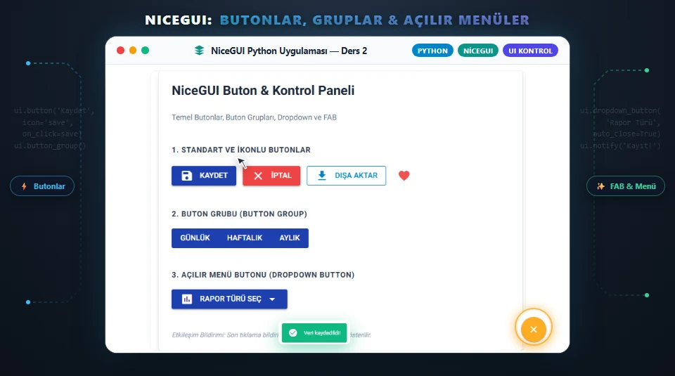

# 🚀 NiceGUI Eğitim Projeleri (1-11. Dersler)



Modern web tabanlı kullanıcı arayüzleri geliştirmeyi sağlayan popüler Python kütüphanesi **[NiceGUI](https://nicegui.io/)** için hazırlanmış 11 derslik kapsamlı eğitim serisinin tüm kaynak kodları ve eğitim banner'ları bu depoda yer almaktadır.

Tüm derslerin detaylı teorik anlatımlarına ve blog yazılarına **[Şefin Atölyesi](https://sef.iofeteknoloji.com/)** üzerinden ulaşabilirsiniz.

---

## 📂 Proje İçeriği ve Ders Kodları (`NiceGUIProjects/`)

Aşağıda serideki tüm derslerin kod dosyaları, konuları, banner önizlemeleri ve blog bağlantıları listelenmiştir:

| Ders | Görsel Banner | Kod Dosyası | Konu Özeti | Eğitim Yazısı |
|:---:|:---:|:---|:---|:---:|
| **01** | [🖼️ İncele](assets/banners/ders01_banner.webp) | [`Ders1.py`](NiceGUIProjects/Ders1.py) | Kurulum ve İlk Web Uygulaması | [Ders 1 Oku](https://sef.iofeteknoloji.com/2026/10/01/nicegui-01-kurulum/) |
| **02** | [🖼️ İncele](assets/banners/ders02_banner.webp) | [`Ders2.py`](NiceGUIProjects/Ders2.py) | Butonlar, Gruplar ve Açılır Menüler | [Ders 2 Oku](https://sef.iofeteknoloji.com/2026/10/01/nicegui-02-butonlar/) |
| **03** | [🖼️ İncele](assets/banners/ders03_banner.webp) | [`Ders3.py`](NiceGUIProjects/Ders3.py) | Chip, Row, Toggle ve Radio Kontrolleri | [Ders 3 Oku](https://sef.iofeteknoloji.com/2026/10/01/nicegui-03-chip-row-toggle-radio/) |
| **04** | [🖼️ İncele](assets/banners/ders04_banner.webp) | [`Ders4.py`](NiceGUIProjects/Ders4.py) | Select, Checkbox, Switch ve Slider | [Ders 4 Oku](https://sef.iofeteknoloji.com/2026/10/01/nicegui-04-select-checkbox-switch-slider/) |
| **05** | [🖼️ İncele](assets/banners/ders05_banner.webp) | [`Ders5.py`](NiceGUIProjects/Ders5.py) | Input, Textarea, CodeMirror ve Özel Girişler | [Ders 5 Oku](https://sef.iofeteknoloji.com/2026/10/01/nicegui-05-input-textarea-codemirror/) |
| **06** | [🖼️ İncele](assets/banners/ders06_banner.webp) | [`Ders6.py`](NiceGUIProjects/Ders6.py) | Metin Öğeleri, Markdown, HTML ve Chat | [Ders 6 Oku](https://sef.iofeteknoloji.com/2026/10/01/nicegui-06-metin-ogeleri/) |
| **07** | [🖼️ İncele](assets/banners/ders07_banner.webp) | [`Ders7.py`](NiceGUIProjects/Ders7.py) | Sayfa Düzeni (Grid, Cards, Tabs, Splitter) | [Ders 7 Oku](https://sef.iofeteknoloji.com/2026/10/01/nicegui-07-yerlesim/) |
| **08** | [🖼️ İncele](assets/banners/ders08_banner.webp) | [`Ders8.py`](NiceGUIProjects/Ders8.py) | Tailwind CSS, Renk Paletleri & Tema | [Ders 8 Oku](https://sef.iofeteknoloji.com/2026/10/01/nicegui-08-bicimlendirme/) |
| **09** | [🖼️ İncele](assets/banners/ders09_banner.webp) | [`Ders9.py`](NiceGUIProjects/Ders9.py) | Reaktif Veri Bağlama (Two-Way Binding) | [Ders 9 Oku](https://sef.iofeteknoloji.com/2026/10/01/nicegui-09-veri-baglama/) |
| **10** | [🖼️ İncele](assets/banners/ders10_banner.webp) | [`Ders10.py`](NiceGUIProjects/Ders10.py) | Görsel, İşitsel ve 3D Medya Bileşenleri | [Ders 10 Oku](https://sef.iofeteknoloji.com/2026/10/01/nicegui-10-gorsel-isitsel/) |
| **11** | [🖼️ İncele](assets/banners/ders11_banner.webp) | [`Ders11.py`](NiceGUIProjects/Ders11.py) | Veri Tabloları, AG Grid & Dashboard | [Ders 11 Oku](https://sef.iofeteknoloji.com/2026/10/01/nicegui-11-veri-ogeleri/) |

---

## 🛠️ Kurulum ve Çalıştırma

### 1. Bağımlılıkları Yükleme
```bash
pip install -r requirements.txt
```
*(veya doğrudan: `pip install nicegui>=1.4.0`)*

### 2. İlgili Dersi Başlatma
Herhangi bir dersi çalıştırmak için `NiceGUIProjects` dizini altındaki dosyayı çalıştırın:
```bash
cd NiceGUIProjects
python Ders1.py
```
Tarayıcınız otomatik olarak `http://localhost:8080` adresinde açılacaktır.

---

## 👨‍💻 Yazar & Topluluk
- **Geliştirici:** Şefin Atölyesi / rhodofer
- **Web Sitesi:** [sef.iofeteknoloji.com](https://sef.iofeteknoloji.com/)
